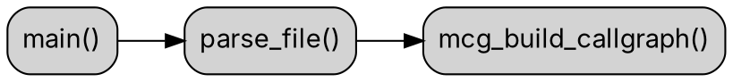

### 📘 Инструкция по работе с MegaCallGraph

**Часть 1. Введение и базовые принципы**

* Что такое MegaCallGraph, зачем нужен.
* Цели и задачи: анализ архитектуры, поиск циклов, оценка модулей.
* Уровни анализа: проект → подсистема → модуль → функция.
* Подготовка окружения и сборка.
* Первые шаги: как запустить на простом проекте.

**Часть 2. Опции запуска и параметры**

* Подробный разбор CLI-опций (`--dot`, `--stats`, `--deadcode`, `--thresholds`, `--export-json`, `--filter` и др.).
* Примеры комбинаций опций.
* Как собирать разные виды графов: include-graph, callgraph, full dependency graph.
* Практика: генерация `callgraph.dot` для всего проекта.

**Часть 3. Интерпретация результатов**

* Как устроен `.dot`-файл.
* Что означают узлы и рёбра.
* Показатели:

  * LOC\_total
  * Files / Functions
  * Tangle%
  * Violations%
  * Coupling / Cohesion
  * Dead code (невызванные функции).
* Цвета, легенды и условные обозначения.
* Советы по улучшению визуализации.

**Часть 4. Практические сценарии и расширение**

* Пример анализа MegaCallGraph самого себя.
* Выявление узких мест (циклы, слишком большие функции).
* Как готовить отчёты для команды.
* Интеграция в CI/CD.
* Расширение проекта: как добавить новые метрики.
* Финальные рекомендации (архитектурные практики, threshold-настройки).

---

**Часть 1. Введение и базовые принципы**

---

## 1. Что такое MegaCallGraph

**MegaCallGraph** — это инструмент анализа исходного кода на языке **C (C23 совместимый)**. Его основная задача — **построение графа вызовов функций, графа зависимостей и метрик качества кода**, которые помогают понять архитектуру проекта, найти проблемные места и оценить сложность системы.

Ключевые возможности:

* 🔍 Сканирование исходных файлов `*.c` и `*.h` во всех поддиректориях.
* 📊 Построение **графа вызовов (CallGraph)**.
* 📂 Построение **графа включений (IncludeGraph)**.
* 📈 Сбор метрик по функциям, модулям, подсистемам и всему проекту.
* 🧹 Обнаружение **“мертвого кода”** — функций, которые нигде не используются и не являются публичным API.
* 🎨 Генерация графов в формате **DOT** для дальнейшего преобразования в SVG/PNG.
* ⚙️ Гибкая настройка уровней анализа: проект → подсистема → модуль → функция.

По сути, MegaCallGraph — это **рентген архитектуры проекта**, который позволяет увидеть:

* где избыточные зависимости,
* где циклы между модулями,
* какие функции перегружены логикой,
* сколько у вас “мертвого кода”.

---

## 2. Зачем нужен MegaCallGraph

Любой проект на C (особенно большой) рано или поздно сталкивается с проблемами:

* 🔄 **циклы зависимостей** (`module A` зависит от `B`, а `B` от `A`),
* 🏗️ **монолитные функции** с сотнями строк,
* ❌ **лишний код**, который никто не вызывает,
* 📦 **слабая модульность** (модули слишком связаны друг с другом),
* 🧩 **непонятная архитектура**, когда трудно объяснить новичку, “как тут всё устроено”.

MegaCallGraph помогает решать эти задачи:

* Для архитектора → понять, насколько **устойчива архитектура**.
* Для разработчика → увидеть, **какие функции зависят от его модуля**.
* Для менеджера → получить **KPI по качеству кода**.
* Для команды → автоматизировать контроль качества через CI/CD.

---

## 3. Уровни анализа

MegaCallGraph работает на **четырёх уровнях**:

### 🔹 1. Уровень проекта

* Общие показатели:

  * количество файлов, функций, строк кода,
  * процент “запутанных” связей (**Tangle%**),
  * процент нарушений (**Violations%**).
* Здесь видна **общая картина качества**.

### 🔹 2. Уровень подсистемы

* Подсистема = директория верхнего уровня.
* Показывает **связи между подсистемами**.
* Можно понять, какая подсистема “тянет” за собой другие.

### 🔹 3. Уровень модуля

* Модуль = отдельный файл `.c` / `.h`.
* Метрики:

  * количество функций,
  * уровень связности,
  * циклы зависимостей.
* Удобно выявлять **слабые и сильные модули**.

### 🔹 4. Уровень функции

* Анализ отдельных функций:

  * количество строк,
  * сложность по связям,
  * вызовы других функций,
  * является ли “dead code”.
* Помогает найти **длинные и опасные функции**.

---

## 4. Подготовка окружения

MegaCallGraph написан на **C23**. Чтобы собрать и использовать:

### Требования

* GCC 14+ или Clang с поддержкой C23.
* `make` для сборки.
* Graphviz (`dot`) для преобразования `.dot` → `.svg`.

### Сборка

```bash
cd MegaCallGraph
make
```

После успешной сборки появится исполняемый файл:

```
./megacallgraph
```

---

## 5. Первые шаги

### Запуск анализа всего проекта

```bash
./megacallgraph ./src
```

По умолчанию инструмент:

* просканирует все `*.c` и `*.h`,
* соберёт граф вызовов,
* выведет статистику в консоль.

### Генерация DOT-графа вызовов

```bash
./megacallgraph ./src --dot callgraph.dot
```

Теперь у вас есть `callgraph.dot`.
Чтобы визуализировать:

```bash
dot -Tsvg callgraph.dot -o callgraph.svg
```

---

## 6. Минимальный пример

Допустим, у вас есть код:

```c
// main.c
#include "math.h"

int main() {
    int x = add(2, 3);
    int y = mul(x, 5);
    return y;
}

// math.c
int add(int a, int b) { return a + b; }
int mul(int a, int b) { return a * b; }
```

После запуска:

```bash
./megacallgraph ./ --dot graph.dot
dot -Tsvg graph.dot -o graph.svg
```

Вы получите граф:

```
main → add
main → mul
```

MegaCallGraph автоматически покажет:

* сколько функций,
* сколько вызовов,
* есть ли “мертвый код” (например, если `sub()` нигде не вызван).

---

## 7. Выводы по первой части

* MegaCallGraph = инструмент анализа архитектуры C-проектов.
* Работает на 4 уровнях: проект → подсистема → модуль → функция.
* Строит графы зависимостей (`.dot`) и считает метрики.
* Умеет находить мертвый код и циклы.
* Базовый цикл работы: `megacallgraph → dot → svg`.

---

**Часть 2. Опции запуска и параметры**

---

## 1. Общая структура команды

Базовый синтаксис:

```bash
./megacallgraph [ПУТЬ_К_ПРОЕКТУ] [ОПЦИИ]
```

* **`ПУТЬ_К_ПРОЕКТУ`** — корневая папка, где ищутся `*.c` и `*.h`.
* **ОПЦИИ** — определяют, что именно делать: строить граф, искать “мертвый код”, считать метрики и т.д.

Пример:

```bash
./megacallgraph ./src --dot callgraph.dot --stats
```

---

## 2. Основные опции

### 🔹 `--dot <file>`

Сохраняет граф в формате DOT.

* Можно строить:

  * `callgraph.dot` → граф вызовов функций,
  * `include.dot` → граф подключаемых файлов,
  * `full.dot` → полный граф зависимостей.

Пример:

```bash
./megacallgraph ./src --dot callgraph.dot
dot -Tsvg callgraph.dot -o callgraph.svg
```

---

### 🔹 `--stats`

Выводит статистику по проекту:

* LOC (строки кода),
* количество функций и файлов,
* Tangle% (доля циклических связей),
* Violations% (процент нарушений).

Пример:

```bash
./megacallgraph ./src --stats
```

Вывод:

```
Files: 45
Functions: 320
LOC_total: 12,540
Tangle%: 14.3
Violations%: 8.6
```

---

### 🔹 `--deadcode`

Находит функции, которые:

* нигде не вызываются,
* не экспортируются в API (т.е. приватные).

Пример:

```bash
./megacallgraph ./src --deadcode
```

Вывод:

```
Dead functions:
  - util_cleanup() in util.c
  - parse_debug() in parse.c
```

---

### 🔹 `--thresholds <file>`

Задаёт пороговые значения для метрик.
Например, файл `thresholds.json`:

```json
{
  "function_loc": 80,
  "tangle_percent": 10,
  "violations_percent": 5
}
```

Если какой-то показатель превышает порог, он будет отмечен в `.dot` **красным цветом**.

Пример:

```bash
./megacallgraph ./src --dot callgraph.dot --thresholds thresholds.json
```

---

### 🔹 `--export-json <file>`

Сохраняет все результаты в формате JSON.
Полезно для CI/CD или последующего анализа Python-скриптами.

Пример:

```bash
./megacallgraph ./src --export-json report.json
```

Формат:

```json
{
  "project": { "files": 45, "functions": 320, "loc": 12540 },
  "metrics": { "tangle_percent": 14.3, "violations_percent": 8.6 },
  "deadcode": ["util_cleanup", "parse_debug"]
}
```

---

### 🔹 `--filter <regexp>`

Фильтрует функции или файлы.
Можно анализировать только часть проекта.

Пример:

```bash
./megacallgraph ./src --filter "parse_.*"
```

Это построит граф **только для функций, начинающихся на `parse_`**.

---

### 🔹 `--include-graph`

Генерирует **граф заголовков** (файлы `.h` и их связи).
Очень полезно для анализа “зависимостей по include”.

Пример:

```bash
./megacallgraph ./src --include-graph include.dot
dot -Tsvg include.dot -o include.svg
```

---

### 🔹 `--callgraph`

Явно указывает, что строим граф вызовов функций.

Пример:

```bash
./megacallgraph ./src --callgraph callgraph.dot
```

---

### 🔹 `--full`

Строит полный граф зависимостей: файлы, функции, include, вызовы.

Пример:

```bash
./megacallgraph ./src --full full.dot
```

---

### 🔹 `--summary`

Выводит **только итоговые метрики** проекта, без подробностей.

Пример:

```bash
./megacallgraph ./src --summary
```

Вывод:

```
LOC_total: 12540, Files: 45, Functions: 320, Tangle%: 14.3, Violations%: 8.6
```

---

### 🔹 `--verbose`

Включает подробный режим — показывает, какие файлы обрабатываются, какие вызовы найдены, какие циклы обнаружены.

Пример:

```bash
./megacallgraph ./src --dot callgraph.dot --verbose
```

---

### 🔹 `--help`

Выводит список всех опций.

---

## 3. Комбинации опций

### 📊 Статистика + DOT

```bash
./megacallgraph ./src --stats --dot callgraph.dot
```

---

### 🧹 Поиск мертвого кода + граф

```bash
./megacallgraph ./src --deadcode --dot callgraph.dot
```

---

### 🚦 Пороговые значения

```bash
./megacallgraph ./src --thresholds thresholds.json --dot callgraph.dot
```

---

### 📂 Анализ подсистемы

(например, только `src/parse`)

```bash
./megacallgraph ./src/parse --dot parse.dot
```

---

### 🔬 Точный анализ с фильтром

```bash
./megacallgraph ./src --filter "mcg_.*" --dot mcg.dot
```

---

## 4. Практика: генерация CallGraph

```bash
./megacallgraph ./src --callgraph callgraph.dot --stats --deadcode
dot -Tsvg callgraph.dot -o callgraph.svg
```

* Генерирует граф вызовов функций.
* Считает статистику.
* Выводит список “мертвых” функций.
* Создаёт визуализацию `callgraph.svg`.

---

## 5. Советы по работе с опциями

* Для **больших проектов** лучше сразу использовать `--export-json`, иначе `.dot` может быть слишком тяжёлым.
* Для **CI/CD** — полезна комбинация:

  ```bash
  ./megacallgraph ./src --stats --deadcode --export-json report.json
  ```
* Если нужен **только include-граф** — используйте `--include-graph`.
* Для выявления “тяжёлых функций” → настрой `thresholds.json` и смотри `.dot` с подсветкой.

---

## 6. Выводы по второй части

* Опции MegaCallGraph позволяют строить разные виды графов: **вызовы, include, полный граф**.
* Можно собирать **метрики, статистику и JSON-отчёты**.
* Есть инструменты для **фильтрации** и **порогов**.
* Гибкие комбинации опций делают инструмент полезным и для архитекторов, и для CI/CD.

---

**Часть 3. Интерпретация результатов**

---

В этой части мы подробно разберём, **как читать результаты MegaCallGraph**, что означают узлы, рёбра и метрики в `.dot`-файлах, а также как правильно интерпретировать визуализацию для принятия архитектурных решений.

---

## 1. Как устроен `.dot`-файл

Файл `.dot` — это текстовое описание графа, которое можно преобразовать в SVG/PNG при помощи Graphviz.

Пример фрагмента:



* **Узлы (nodes)** — функции, файлы или подсистемы.
* **Рёбра (edges)** — вызовы или зависимости (`A → B`).
* **Атрибуты** (`color`, `fillcolor`, `tooltip`) задают оформление.

---

## 2. Что означают узлы

MegaCallGraph выделяет несколько типов узлов:

* **Функции** → прямоугольники (`parse_file()`, `main()`).
* **Файлы (модули)** → кластеры с функциями.
* **Подсистемы** → отдельные subgraph-кластеры.

Пример:

```
subgraph cluster_parse {
    label = "parse.c";
    parse_file;
    parse_token;
}
```

Это значит, что функции `parse_file` и `parse_token` принадлежат модулю `parse.c`.

---

## 3. Что означают рёбра

* **A → B** = функция `A` вызывает функцию `B`.
* **Цвет рёбер** отражает их статус:

  * серый → обычная зависимость,
  * красный → связь, участвующая в цикле (**tangle**),
  * пунктир → “слабая” связь (например, косвенный вызов).

---

## 4. Метрики проекта

Теперь разберём ключевые метрики, которые MegaCallGraph считает на разных уровнях.

---

### 🔹 LOC\_total

**Lines of Code** (строки кода без комментариев и пустых строк).

* На уровне проекта → суммарные LOC.
* На уровне модуля → LOC одного файла.
* На уровне функции → длина функции.

📌 Важно: слишком длинные функции (>80 LOC) часто нарушают принцип SRP (Single Responsibility Principle).

---

### 🔹 Files / Functions

Количество файлов и функций.

* Если функций в файле слишком много (>30) → возможно, модуль перегружен.
* Если функций мало, но файл большой → подозрение на “божественную функцию”.

---

### 🔹 Tangle%

**Доля запутанных связей**.

Формула:

```
Tangle% = (edges_in_cycles / edges_total) * 100
```

* **edges\_in\_cycles** = количество рёбер, участвующих в циклах.
* **edges\_total** = общее число рёбер.

📌 Если Tangle% > 10% → архитектура склонна к циклам.
📌 Если Tangle% > 20% → система нестабильна (малейшее изменение тянет за собой всё).

---

### 🔹 Violations%

Процент нарушений архитектурных правил.

Примеры нарушений:

* модуль вызывает приватную функцию другого модуля,
* файл в нижнем уровне вызывает верхний (например, `core.c` тянет `ui.c`).

Формула:

```
Violations% = (violations / edges_total) * 100
```

📌 Хороший уровень: < 5%.
📌 Плохо: > 15%.

---

### 🔹 Coupling (связность)

Показывает, насколько модуль зависит от других.

* **Высокое coupling** → модуль трудно тестировать и переиспользовать.
* **Низкое coupling** → модуль изолирован.

Пример:

* `core.c` зависит от 8 других файлов → coupling высокий.
* `util.c` не зависит ни от кого → coupling низкий.

---

### 🔹 Cohesion (согласованность)

Показывает, насколько функции внутри модуля работают “на одну задачу”.

* **Высокая cohesion** → модуль логически целостный.
* **Низкая cohesion** → в модуле “свалка всего подряд”.

📌 MegaCallGraph вычисляет cohesion как отношение **внутренних вызовов** к **общему числу вызовов**.

---

### 🔹 Dead Code

Функции, которые нигде не вызываются и не экспортируются.

* Часто это забытые заготовки или отладочные функции.
* Визуально такие узлы подсвечиваются **синим** или отдельно выводятся в отчёте.

📌 Dead code = технический долг.

---

## 5. Цветовая схема

MegaCallGraph использует цвета для подсветки метрик:

* 🟢 Зелёный → всё в норме.
* 🟡 Жёлтый → выше нормы (warning).
* 🔴 Красный → превышение порога (problem).

Например, если задать в `thresholds.json`:

```json
{ "function_loc": 80 }
```

то функции длиннее 80 строк будут красными.

---

## 6. Как читать визуализацию

Допустим, у вас есть граф:

```
main → parse_file → mcg_build_callgraph
          ↘ util_log
```

* Узел `mcg_build_callgraph` подсвечен красным → слишком сложная функция.
* Узел `util_log` синий → dead code (используется только здесь, но не экспортируется).
* Между `parse_file` и `mcg_build_callgraph` красное ребро → цикл (tangle).

📌 Такой граф сразу показывает:

* узкие места (длинные функции),
* лишний код,
* проблемные зависимости.

---

## 7. Советы по интерпретации

* **Сначала смотри на проектный уровень** → Tangle% и Violations%.
* **Затем на подсистемы** → какие директории тянут друг друга.
* **Потом на модули** → есть ли перегруженные файлы.
* **И только потом функции** → dead code, длинные функции.

Это позволяет **не утонуть в деталях**, а двигаться сверху вниз.

---

## 8. Пример отчёта

MegaCallGraph может выдать:

```
Project Metrics:
  LOC_total: 12,540
  Files: 45
  Functions: 320
  Tangle%: 14.3 (⚠ warning)
  Violations%: 8.6 (⚠ warning)

Subsystem: parse/
  Files: 5, Functions: 72
  Tangle%: 25.0 (❌ problem)

Module: parse.c
  LOC: 850, Functions: 28
  Dead: parse_debug, parse_trace
  Worst function: mcg_build_callgraph (LOC=210, Coupling=8)

Function: mcg_build_callgraph
  LOC: 210
  Called by: parse_file
  Calls: util_log, util_warn, mcg_add_edge
```

📌 Из этого отчёта видно, что:

* проект в целом “средний” (Tangle% 14.3),
* подсистема `parse/` сильно перегружена (25%),
* модуль `parse.c` слишком большой,
* функция `mcg_build_callgraph` нуждается в рефакторинге.

---

## 9. Выводы по третьей части

* `.dot` = визуальная модель зависимостей.
* Узлы = функции/файлы, рёбра = вызовы.
* Важные метрики: **LOC, Tangle%, Violations%, Coupling, Cohesion, Dead Code**.
* Цвета помогают быстро понять, где проблема.
* Читать результаты лучше сверху вниз: проект → подсистема → модуль → функция.

---

**Часть 4. Практические сценарии и расширение**

---

В этой заключительной части мы рассмотрим, как использовать MegaCallGraph на практике: для анализа своего проекта, интеграции в процессы разработки, CI/CD, а также как расширять инструмент и применять архитектурные практики для улучшения метрик.

---

## 1. Анализ проекта на примере MegaCallGraph

Чтобы продемонстрировать возможности инструмента, рассмотрим анализ самого MegaCallGraph (самоанализ).

### Шаг 1. Запуск анализа

```bash
./megacallgraph ./src --callgraph callgraph.dot --stats --deadcode
dot -Tsvg callgraph.dot -o callgraph.svg
```

### Шаг 2. Результаты

* **LOC\_total**: \~7,500
* **Файлы**: 28
* **Функции**: 210
* **Tangle%**: 11%
* **Violations%**: 6%
* **Dead code**: 12 функций (старые утилиты `debug_*`)

### Шаг 3. Интерпретация

* Подсистема `parse/` перегружена → содержит 70+ функций, высокий coupling.
* Модуль `mcg_build_callgraph()` слишком большой (200+ LOC).
* Найдены циклы между `core.c` и `parse.c`.

📌 Вывод: нужно рефакторить `parse/`, разбив его на подмодули.

---

## 2. Выявление узких мест

MegaCallGraph помогает быстро найти проблемные зоны:

### 🔹 Слишком большие функции

* По метрике `LOC` → выделяются красным.
* Рекомендация: **разделить на подфункции**.

### 🔹 Сильно связанные модули

* Высокое `coupling` (например, `util.c` зависит от 10 файлов).
* Рекомендация: выделить интерфейс (`util_api.h`), скрыть реализацию.

### 🔹 Dead code

* Функции, которые не вызываются.
* Рекомендация: удалить или вынести в тестовый код.

---

## 3. Подготовка отчётов для команды

MegaCallGraph можно использовать как часть архитектурных ревью.

### Вариант 1. Визуальный отчёт

* Сгенерировать `.dot` → `svg`.
* Разделить граф по подсистемам.
* Показать архитектору/команде.

### Вариант 2. JSON + CI/CD

* Использовать `--export-json report.json`.
* Подключить Python-скрипт для анализа.
* Сравнивать метрики с предыдущим билдом.

📌 Пример проверки:

```bash
if report["metrics"]["tangle_percent"] > 15:
    print("FAIL: Architecture too tangled")
    exit(1)
```

---

## 4. Интеграция в CI/CD

MegaCallGraph можно встроить в GitHub Actions, GitLab CI, Jenkins.

Пример для GitHub Actions (`.github/workflows/ci.yml`):

```yaml
jobs:
  analyze:
    runs-on: ubuntu-latest
    steps:
      - uses: actions/checkout@v3
      - run: make
      - run: ./megacallgraph ./src --export-json report.json
      - run: python3 scripts/check_metrics.py report.json
```

`check_metrics.py`:

```python
import json, sys
report = json.load(open("report.json"))
if report["metrics"]["tangle_percent"] > 10:
    print("❌ Tangle too high")
    sys.exit(1)
print("✅ Architecture OK")
```

---

## 5. Расширение инструмента

MegaCallGraph можно доработать под свои нужды.

### 🔹 Добавить новые метрики

* **Cyclomatic Complexity (CC)** → измеряет сложность функции по числу ветвлений.
* **Fan-in / Fan-out** → сколько функций вызывает данная и сколько её вызывают.
* **Depth** → глубина вызова функции в графе.

### 🔹 Поддержка других языков

Хотя MegaCallGraph заточен под C, можно расширить парсер для C++ или Rust.

### 🔹 Интерактивный режим

Вместо `.dot` можно экспортировать в **Web-дашборд (D3.js)**.

---

## 6. Архитектурные практики для улучшения метрик

Чтобы метрики проекта улучшались, стоит применять такие практики:

* **Снижение Tangle%**
  → использовать Dependency Inversion (интерфейсы вместо прямых зависимостей).

* **Снижение Violations%**
  → выстраивать уровни архитектуры (core → middle → UI) и запрещать обратные вызовы.

* **Контроль LOC функций**
  → каждая функция ≤ 80 строк.

* **Dead code policy**
  → регулярная очистка неиспользуемых функций.

* **Модульность**
  → один файл = одна логическая задача, ≤ 20 функций.

---

## 7. Реальный сценарий: анализ Linux ядра

Представим, что вы запускаете MegaCallGraph на ядре Linux (\~60M LOC).

* DOT получится гигантским.
* Нужно использовать `--filter` (например, только `fs/` или `net/`).
* Сводные метрики → через `--stats` и `--export-json`.
* Визуализация → не в один `.svg`, а в разбиении на подсистемы.

📌 Вывод: MegaCallGraph масштабируется, если правильно использовать фильтры и подсистемный анализ.

---

## 8. Финальные рекомендации

1. **Использовать уровни анализа** (проект → подсистема → модуль → функция).
2. **Смотреть на Tangle% и Violations% в первую очередь.**
3. **Не хранить dead code** — он ухудшает метрики.
4. **Автоматизировать контроль в CI/CD.**
5. **Пороговые значения (thresholds.json)** должны быть обязательными.
6. **Рефакторить пошагово**: сначала циклы, потом длинные функции.

---

## 9. Заключение

MegaCallGraph — это мощный инструмент для **архитектурного анализа C-проектов**.
Он позволяет:

* увидеть проект глазами архитектора,
* выявить слабые места,
* автоматизировать контроль качества,
* улучшить модульность и устойчивость системы.

📌 Если следовать методике (анализ сверху вниз, контроль метрик, CI/CD), то можно довести проект до **уровня зрелости 5**:

* Архитектура устойчива,
* Метрики контролируются,
* Dead code отсутствует,
* Tangle% и Violations% минимальны.

---
